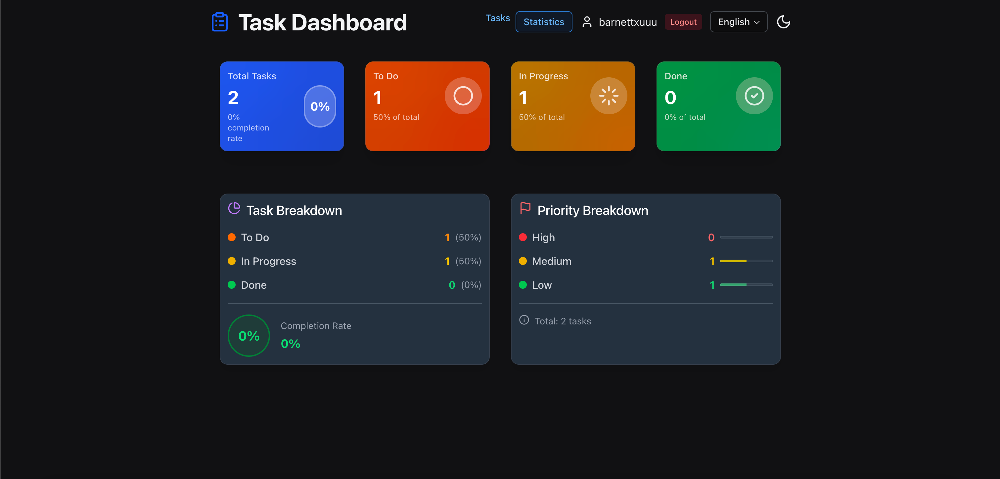
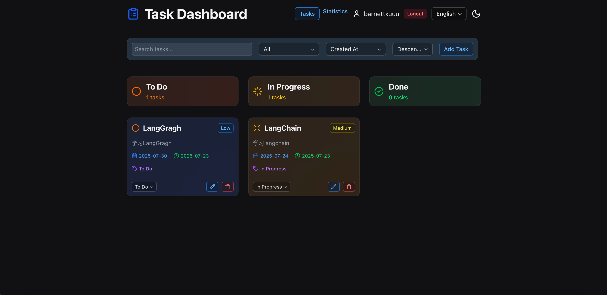

# Task Dashboard v1.2.0

A modern, full-stack task management application built with Reflex (Python reactive web framework) and FastAPI. Features a responsive web interface with real-time updates, comprehensive REST API, and full bilingual support (English/Chinese).


*Task Statistics Dashboard*


*Task Management Interface*

## Features

### 🌐 Web Interface
- **Modern, responsive UI** with multi-page navigation (Tasks/Statistics)
- **Kanban-style columns**: Todo, In Progress, Done
- **Real-time updates** between web UI and database
- **Task statistics** dashboard with gradient cards and progress indicators
- **Responsive design** works on desktop, tablet, and mobile
- **Dark/light mode** toggle with smooth transitions

### 📊 Statistics Dashboard
- **Modern gradient cards** for task counts and completion rates
- **Real-time statistics** with circular progress indicators
- **Task breakdown** by status with visual progress bars
- **Priority analytics** with progress tracking
- **Responsive grid layout** for all screen sizes

### 🔍 Advanced Filtering
- **Filter by status**: All, Todo, In Progress, Done
- **Search functionality** across titles and descriptions
- **Sort by**: Created date, due date, priority, or title
- **Ascending/descending** order options
- **Real-time filtering** with instant results

### 🌏 Bilingual Support
- **Full English and Chinese** language support
- **Instant language switching** with reactive updates
- **Comprehensive coverage**: 60+ translated UI elements
- **Professional localization** for all user-facing text

### 🔧 Backend Features
- **REST API**: Full CRUD operations with filtering and search
- **SQLite by default** with MySQL production support
- **API documentation**: Auto-generated Swagger/OpenAPI docs
- **Health monitoring**: Built-in health check endpoints
- **Comprehensive testing** suite with pytest

### 🎯 Task Management
- **Create, read, update, delete** tasks with full validation
- **Priority levels**: Low, Medium, High with color coding
- **Due dates** with quick selection buttons (Today, Tomorrow, Next Week)
- **Status tracking**: Todo → In Progress → Done workflow
- **Modern task cards** with gradient backgrounds based on priority

## Quick Start

### Prerequisites
- Python 3.8+
- pip (Python package manager)

### Installation

1. Clone the repository:
```bash
git clone <repository-url>
cd task-dashboard
```

2. Install dependencies:
```bash
pip install -r requirements.txt
```

3. Start the development server:
```bash
reflex run
```

4. Open your browser to [http://localhost:3000](http://localhost:3000)

## Development

### Running the Application

#### Full Stack (Web UI + API)
```bash
# Development server with hot reload
reflex run

# Access at http://localhost:3000
```

#### API Only
```bash
# Run API server on port 8000
python -m task_dashboard.api

# Or with uvicorn directly
uvicorn task_dashboard.api:api_app --reload --port 8000
```

#### Production Build
```bash
# Generate static build for deployment
reflex export
```

### Database Configuration

The application supports both SQLite (default for development) and MySQL (for production).

#### Environment Files
- `.env` - Development configuration (default: SQLite)
- `.env.production` - Production configuration (MySQL)

#### SQLite Configuration (Default)
```bash
DB_TYPE=sqlite
DB_PATH=task_dashboard.db
```

#### MySQL Configuration
```bash
DB_TYPE=mysql
DB_HOST=your_mysql_host
DB_PORT=3306
DB_USER=your_mysql_user
DB_PASSWORD=your_mysql_password
DB_NAME=task_dashboard
```

To use MySQL, either:
1. Set `DB_TYPE=mysql` in your .env file
2. Or use the `.env.production` file

### Testing

Run the comprehensive test suite:

```bash
# Run all tests
python -m pytest tests/ -v

# Run specific test file
python tests/test_api.py -v

# Run with coverage
python -m pytest tests/ --cov=task_dashboard
```

## API Usage

The REST API is available at `http://localhost:8000` when running the API server.

### Authentication
All API endpoints require authentication via Bearer token. Use the following endpoints to manage authentication:

- **POST** `/auth/register` - Register new user account
- **POST** `/auth/login` - Login and receive Bearer token
- **GET** `/auth/me` - Get current user information

### Protected Endpoints
All task endpoints require Bearer token authentication:

- **GET** `/tasks` - List all tasks with optional filtering
- **POST** `/tasks` - Create a new task
- **GET** `/tasks/{id}` - Get a specific task
- **PUT** `/tasks/{id}` - Update a task
- **PATCH** `/tasks/{id}/status` - Update task status only
- **DELETE** `/tasks/{id}` - Delete a task
- **GET** `/health` - Health check endpoint

### API Examples

```bash
# Register new user
curl -X POST http://localhost:8000/auth/register \
  -H "Content-Type: application/json" \
  -d '{
    "username": "user1",
    "email": "user1@example.com",
    "password": "password123"
  }'

# Login to get Bearer token
curl -X POST http://localhost:8000/auth/login \
  -H "Content-Type: application/json" \
  -d '{
    "username": "user1",
    "password": "password123"
  }'

# List all tasks (with Bearer token)
curl -H "Authorization: Bearer user1" http://localhost:8000/tasks

# Filter tasks by status and priority
curl -H "Authorization: Bearer user1" "http://localhost:8000/tasks?status=todo&priority=high"

# Search tasks
curl -H "Authorization: Bearer user1" "http://localhost:8000/tasks?search=urgent"

# Create a new task (with Bearer token)
curl -X POST http://localhost:8000/tasks \
  -H "Content-Type: application/json" \
  -H "Authorization: Bearer user1" \
  -d '{
    "title": "Complete project documentation",
    "description": "Write comprehensive README and API docs",
    "priority": "high",
    "due_date": "2024-12-31"
  }'

# Update task status
curl -X PATCH http://localhost:8000/tasks/1/status \
  -H "Content-Type: application/json" \
  -H "Authorization: Bearer user1" \
  -d '{"status": "done"}'

# Get current user info
curl -H "Authorization: Bearer user1" http://localhost:8000/auth/me
```

### API Documentation

Interactive API documentation is available at:
- **Swagger UI**: http://localhost:8000/docs
- **ReDoc**: http://localhost:8000/redoc

## Language Support

The application supports both English and Chinese languages with instant switching:

- **Language Selector**: Located in the top-right corner of the web interface
- **Instant Translation**: All UI elements update immediately when switching languages
- **Comprehensive Coverage**: 60+ translated elements including buttons, labels, messages, and help text

### Available Languages
- **English** (en): Default language
- **中文** (zh): Simplified Chinese

### Adding New Languages
To add support for additional languages:

1. Edit `task_dashboard/translations.py`
2. Add new language dictionary in the `translations` dictionary
3. Add language to `get_available_languages()` method
4. Restart the application

Example structure for new language:
```python
"es": {
    "app_title": "Panel de Tareas",
    "sign_in": "Iniciar Sesión",
    # ... add all required translation keys
}
```

## Development

### Architecture Overview
The codebase follows a modular architecture with clear separation of concerns:

- **task_dashboard.py**: Main Reflex application entry point
- **api.py**: FastAPI REST endpoints with authentication
- **auth.py**: JWT-based authentication utilities
- **database.py**: SQLAlchemy models and database configuration
- **models.py**: Pydantic data models for API responses
- **state.py**: Centralized state management with translation support
- **components.py**: Reusable UI components
- **modals.py**: Modal dialogs for forms
- **translations.py**: Multi-language support system

## Architecture

### Technology Stack
- **Frontend**: Reflex (Python reactive web framework)
- **Backend**: FastAPI with SQLAlchemy ORM
- **Database**: SQLite (development) / MySQL (production)
- **Styling**: Tailwind CSS with Reflex components
- **Testing**: pytest with FastAPI TestClient

### Project Structure
```
task-dashboard/
├── task_dashboard/
│   ├── __init__.py
│   ├── task_dashboard.py  # Main Reflex app
│   ├── api.py             # FastAPI endpoints
│   ├── auth.py            # Authentication utilities
│   ├── database.py        # SQLAlchemy models and DB config
│   ├── models.py          # Pydantic data models
│   ├── state.py           # Reflex State class with business logic
│   ├── components.py      # Reusable UI components
│   ├── modals.py          # Modal dialogs for forms
│   └── translations.py    # Multi-language support (EN/ZH)
├── tests/
│   ├── __init__.py
│   ├── test_api.py        # API tests
│   └── test_api_auth.py   # Authentication tests
├── assets/
│   └── favicon.ico
├── requirements.txt       # Python dependencies
├── rxconfig.py           # Reflex configuration
└── task_dashboard.db     # SQLite database
```

### State Management
The application uses Reflex's reactive state management:
- User actions trigger state methods
- State methods update the database
- Database changes automatically re-render the UI
- All state is synchronized between web UI and database
- **Bilingual Support**: Language switching handled through reactive translation system

## Task Model

Each task contains:
- **title**: Task title (required)
- **description**: Detailed description (optional)
- **status**: todo, in_progress, or done
- **priority**: low, medium, or high
- **due_date**: Optional due date (YYYY-MM-DD format)
- **created_at**: Auto-generated creation timestamp
- **updated_at**: Auto-generated update timestamp

## Features in Detail

### Web Interface
- **Kanban-style columns**: Todo, In Progress, Done
- **Task statistics**: Real-time counters and completion rates
- **Advanced filtering**: Filter by status, priority, search terms
- **Sorting**: Sort by creation date, due date, priority, or title
- **Quick actions**: Edit, delete, and update status
- **Responsive design**: Works on desktop, tablet, and mobile
- **Bilingual UI**: Switch between English and Chinese with instant translation

### API Features
- **Full CRUD operations**: Create, read, update, delete tasks
- **Filtering**: Filter by status, priority, and search terms
- **Validation**: Input validation and error handling
- **Pagination**: Support for large datasets
- **Health checks**: API health monitoring endpoint

## Contributing

1. Fork the repository
2. Create a feature branch: `git checkout -b feature-name`
3. Make your changes
4. Add tests for new functionality
5. Run the test suite: `python -m pytest tests/`
6. Commit your changes: `git commit -am 'Add new feature'`
7. Push to the branch: `git push origin feature-name`
8. Submit a pull request

## License

This project is licensed under the MIT License - see the [LICENSE](LICENSE) file for details.

## Support

For questions or issues:
- Check the [API documentation](http://localhost:8000/docs)
- Review the [test files](tests/) for usage examples
- Open an issue on the repository